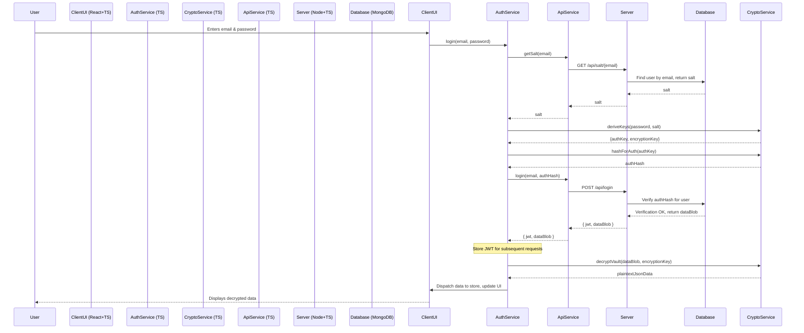
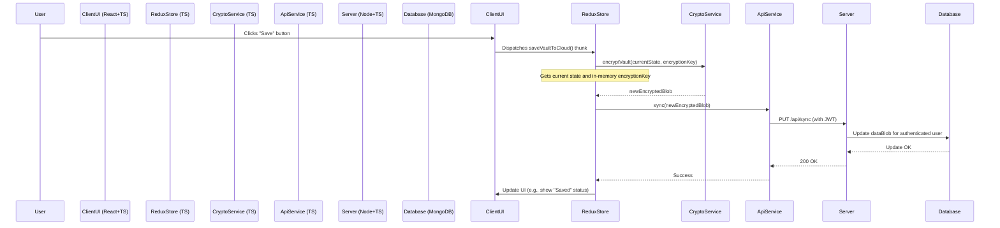

# Low-Level Architecture Document

## Phase 1: The Insightful Relationship Map (MVP)

**Document Details:**
- Version: 1.1 (TypeScript)
- Status: For Implementation
- Author: Shubhendu Vaid
- Date: August 31, 2025

## 1. Introduction

### 1.1. Purpose

This document provides a detailed, low-level design for the "Insightful Relationship Map" MVP, specifying a full-stack TypeScript implementation. It breaks down the high-level architectural components into specific modules, classes, functions, and data structures with type definitions. This document is intended for the engineering team to use as a direct blueprint for implementation, with a primary focus on the correct and secure execution of the zero-knowledge cryptographic model.

## 2. Client Application Architecture (React SPA with TypeScript)

The client application is the core of the system and contains all the logic for data management, analysis, and security. It will be built as a Single Page Application (SPA) using React with TypeScript.

### 2.1. Directory Structure & Component Overview

```
/src
|-- /components       # Reusable UI components (*.tsx)
|-- /features         # Feature-based modules
|   |-- /auth         # User authentication components and logic
|   |-- /contacts     # Components for CRUD operations on contacts
|   |-- /graph        # The main network visualization component
|-- /services         # Core application logic services
|   |-- AuthService.ts
|   |-- CryptoService.ts
|   |-- ApiService.ts
|   |-- SNAService.ts
|-- /store            # State management (Redux Toolkit with TypeScript)
|   |-- vaultSlice.ts
|   |-- userSlice.ts
|-- /types            # Shared TypeScript type definitions
|   |-- index.ts
|-- /utils            # Helper functions
|-- App.tsx
|-- index.tsx
```

### 2.2. Service Layer Deep Dive

#### 2.2.1. CryptoService.ts

This is the most critical security module. It will be a static class with no internal state, responsible for all cryptographic operations. It will use the native Web Crypto API.

- **deriveKeys(password: string, salt: Uint8Array): Promise<{ authKey: CryptoKey, encryptionKey: CryptoKey }>**:
  - Input: password (string), salt (Uint8Array).
  - Action: Uses PBKDF2-SHA-256 with 600,000 iterations to derive two separate keys from the master password and salt.
  - Output: An object { authKey, encryptionKey }.

- **hashForAuth(authKey: CryptoKey): Promise<string>**:
  - Input: authKey derived from deriveKeys.
  - Action: Performs a final SHA-256 hash on the derived auth key to create the authHash that is sent to the server.
  - Output: Hex-encoded authHash string.

- **encryptVault(jsonData: string, encryptionKey: CryptoKey): Promise<string>**:
  - Input: jsonData (string), encryptionKey (CryptoKey object).
  - Action:
    - Generates a new, random 12-byte Initialization Vector (IV).
    - Encrypts the jsonData using AES-256-GCM.
    - Concatenates the IV, GCM authentication tag, and the ciphertext.
  - Output: A Base64-encoded string representing the full encrypted dataBlob.

- **decryptVault(dataBlob: string, encryptionKey: CryptoKey): Promise<string>**:
  - Input: dataBlob (Base64 string), encryptionKey (CryptoKey object).
  - Action:
    - Decodes the Base64 dataBlob.
    - Extracts the IV, authentication tag, and ciphertext.
    - Performs AES-256-GCM decryption. Verifies the authentication tag to protect against tampering.
  - Output: Plaintext jsonData string. Throws an error if decryption fails.

#### 2.2.2. AuthService.ts

Manages the user's authentication state and orchestrates the login/registration process.

- **register(email: string, password: string): Promise<void>**:
  - Generates a new random salt.
  - Calls CryptoService.deriveKeys(password, salt) to get the authKey.
  - Calls CryptoService.hashForAuth(authKey) to get the authHash.
  - Calls ApiService.register(email, salt, authHash).
  - On success, stores the JWT and sets the user state.

- **login(email: string, password: string): Promise<void>**:
  - Calls ApiService.getSalt(email).
  - Calls CryptoService.deriveKeys(password, salt) to get authKey and encryptionKey.
  - Calls CryptoService.hashForAuth(authKey) to get authHash.
  - Calls ApiService.login(email, authHash).
  - On success, receives JWT and dataBlob. Stores JWT.
  - Calls CryptoService.decryptVault(dataBlob, encryptionKey) to get the plaintext vault data.
  - Dispatches the decrypted data to the Redux store.

#### 2.2.3. SNAService.ts

Handles the transformation of application data into a format usable by the graph library and calculates SNA metrics.

- **calculateMetrics(vaultData: VaultState): GraphData**:
  - Input: The plaintext vaultData JSON object from the store.
  - Action:
    - Tie Strength: Iterates through interactions to calculate interaction frequency between contacts. Assigns a weight attribute to each relationship.
    - Centrality: Uses a graphology/cytoscape.js algorithm (e.g., Brandes algorithm for betweenness centrality) on the graph structure to calculate a centrality score for each contact. Assigns a centrality attribute to each contact.
  - Output: A new graph data object with calculated metrics ({ nodes, edges }).

### 2.3. State Management (/store)

We will use Redux Toolkit for centralized and predictable state management, leveraging its strong TypeScript support.

- **vaultSlice.ts**:
  - State: `interface VaultState { contacts: Contact; interactions: Interaction; relationships: Relationship; status: 'idle' | 'loading' | 'succeeded' | 'failed'; }`.
  - Reducers: Standard CRUD operations (addContact, updateContact, etc.) with typed payloads. These reducers operate only on the unencrypted, in-memory state.
  - Thunks: Asynchronous actions like saveVaultToCloud, which will orchestrate the process of reading the current state, calling CryptoService.encryptVault, and then ApiService.sync.

## 3. Backend API Architecture (Node.js & Express with TypeScript)

The backend is a minimalist, stateless API. It will be developed using Node.js and Express with TypeScript, using ts-node for development and compiling to JavaScript for production.

### 3.1. Middleware

- **authMiddleware.ts**:
  - Verifies the JWT from the Authorization: Bearer <token> header.
  - If valid, decodes the token and attaches the userId to the Express Request object (custom type declaration will be needed).
  - If invalid, returns a 401 Unauthorized error.

### 3.2. Controllers & Routes

- **authController.ts**:
  - POST /api/register: Validates input, checks if email exists, hashes the authHash one more time with a server-side pepper before storing, creates the user document, and returns a JWT.
  - POST /api/login: Finds user by email, compares the peppered authHash from the request with the stored one. On success, returns a new JWT and the dataBlob.
  - GET /api/salt/:email: Retrieves the salt for a given user to allow for client-side hashing during the login attempt.

- **vaultController.ts**:
  - PUT /api/sync: Protected by authMiddleware. Receives the new dataBlob and updates the corresponding field in the user's document in the database.

## 4. Database Schema (MongoDB with Mongoose)

A single collection `users` will be used. A Mongoose schema will define the structure and types.

**Collection**: users

**Schema (TypeScript Interface)**:
```typescript
import { Document } from 'mongoose';

export interface IUser extends Document {
  email: string;
  salt: string; // Hex-encoded
  authHash: string; // Hex-encoded, peppered hash
  dataBlob?: string; // Base64-encoded encrypted vault
  createdAt: Date;
  updatedAt: Date;
}
```

## 5. Detailed Sequence Diagrams

### 5.1. Login and Decryption Flow



### 5.2. Data Sync (Save) Flow

